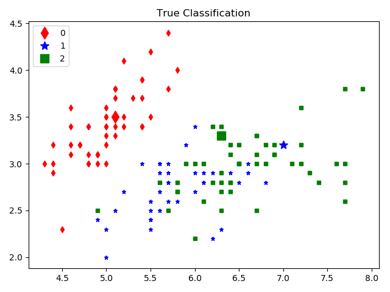
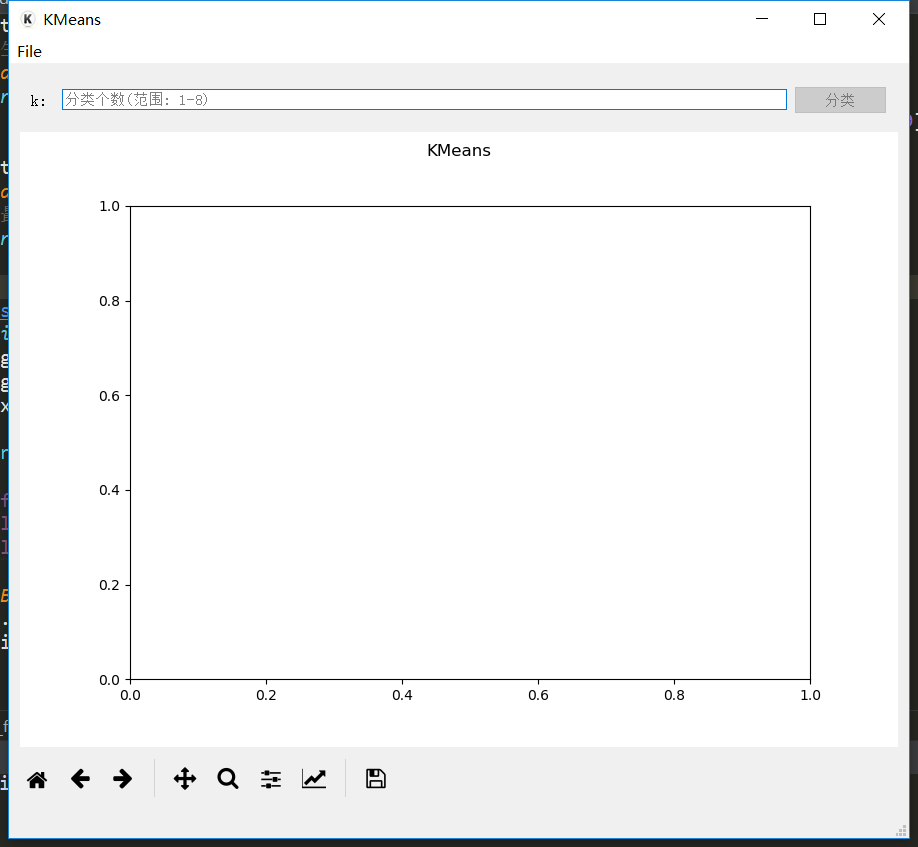
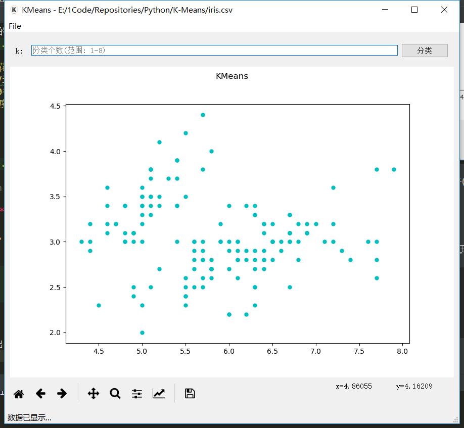
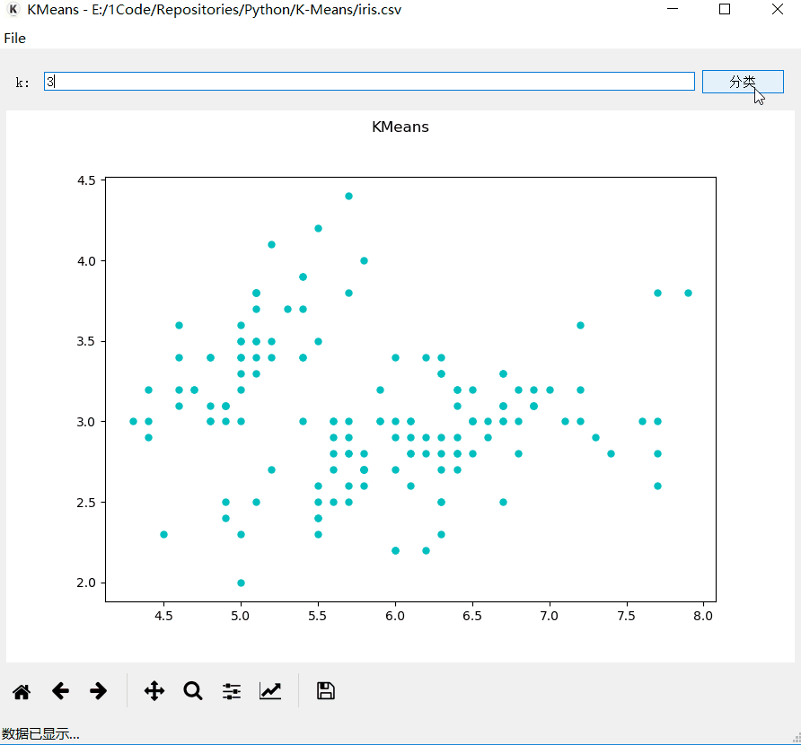
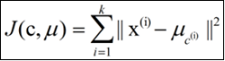
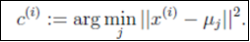
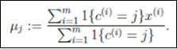
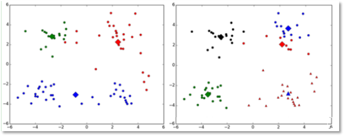
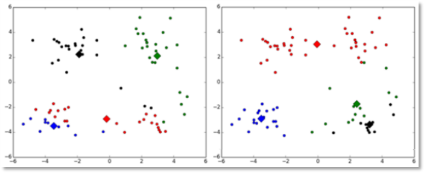
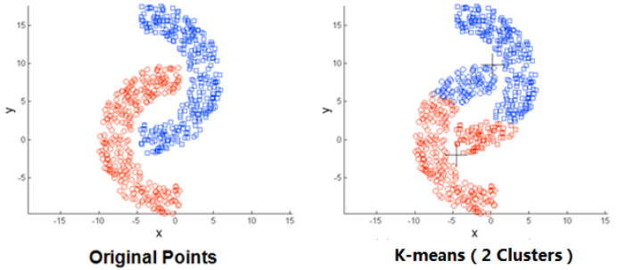

# KMeans算法实现

**[博客查看网址: https://vonsdite.cn/posts/b62ef61c.html](https://vonsdite.cn/posts/b62ef61c.html)**

## 项目介绍

**使用前记得先安装相关的包**
```
pip install -r requirement.txt
```

### 以本项目为例
1. 先运行`dataClean.py`程序, 对数据`iris.data`做处理, 得到`iris.csv`以及真实的分类图


> `iris.data`是鸢尾花数据集, 包含3个不同品种的鸢尾花(Setosa, Versicolour, and Virginica)数据, 以及花瓣和萼片的长度、宽度。 数据有150行4列, 150行指150朵花, 4列分别是Sepal Length(萼片长度), Sepal Width(萼片宽度), Petal Length(花瓣长度) and Petal Width(花瓣宽度)

2. 运行`main.py`



3. 点击 `打开`-`open file`, 打开csv文件(也只能打开csv文件)

**注意csv文件的要求:**
- 要带有表头
- 数据是两列数值数据, 所以需要先处理数据
数据格式类似如下
```csv
x,y
1,1
2,3
4,5
```

4. 打开后, 会先绘制出数据的散点图


5. 输入`分类个数k`-点击`分类`, 分类过程如下

分类过程中, **左下角状态栏**会显示**当前的状态**



### 分类结果比较


**分析**

因为数据只用到了**萼片的宽度和长度**, 只做了二维数据的`k-means`, 所以对于区分**1类**和**2类花朵**的效果还没达到完全区分的效果, 但是已经能完全区分**0类花朵**了

提升方面, 提升维度, 把花瓣的宽度和长度也考虑进去, 可能可以更好的区分

## K-Means介绍

### 概述

`K-means算法`是集简单和经典于一身的**基于距离**的聚类算法

采用距离作为相似性的评价指标, 即认为两个对象的距离越近, 其相似度就越大。

该算法认为类簇是由距离靠近的对象组成的, 因此把得到**紧凑且独立**的簇作为最终目标。

### 核心思想
通过迭代寻找k个类簇的一种划分方案, 使得用这k个类簇的均值来代表相应各类样本时所得的总体误差最小。

k个聚类具有以下特点：各聚类本身尽可能的紧凑, 而各聚类之间尽可能的分开。

 k-means算法的基础是最小误差平方和准则,

其代价函数是：
 式中, μc(i)表示第i个聚类的均值。


各类簇内的样本越相似, 其与该类均值间的误差平方越小, 对所有类所得到的误差平方求和, 即可验证分为k类时, 各聚类是否是最优的。

上式的代价函数无法用解析的方法最小化, 只能有迭代的方法。

### 算法实现步骤

k-means算法是将样本聚类成 k个簇(cluster), 其中k是用户给定的, 其求解过程非常直观简单, 具体算法描述如下：

1) 随机选取 k个聚类质心点

2) 重复下面过程直到收敛  {

对于每一个样例 i, 计算其应该属于的类：

        
对于每一个类 j, 重新计算该类的质心：

}

其伪代码如下：

```
创建k个点作为初始的质心点(随机选择)

当任意一个点的簇分配结果发生改变时

       对数据集中的每一个数据点

              对每一个质心

                     计算质心与数据点的距离

              将数据点分配到距离最近的簇

       对每一个簇, 计算簇中所有点的均值, 并将均值作为质心

```

### K-means算法补充

K-means算法的缺点及改进方法

(1)k值的选择是用户指定的,不同的k得到的结果会有挺大的不同,如下图所示,左边是k=3的结果,这个就太稀疏了,蓝色的那个簇其实是可以再划分成两个簇的。而右图是k=5的结果,可以看到红色菱形和蓝色菱形这两个簇应该是可以合并成一个簇的：

改进：

对k的选择可以先用一些算法分析数据的分布,如重心和密度等,然后选择合适的k



(2)对k个**初始质心**的选择比较敏感,容易陷入**局部最小值**。例如,我们上面的算法运行的时候,有可能会得到不同的结果,如下面这两种情况。K-means也是收敛了,只是收敛到了局部最小值：

改进：

有人提出了另一个成为二分k均值(bisecting k-means)算法,它对初始的k个质心的选择就不太敏感



(3)存在局限性,如下面这种非球状的数据分布就搞不定了：



(4)数据集**比较大**的时候,收敛会**比较慢**。
